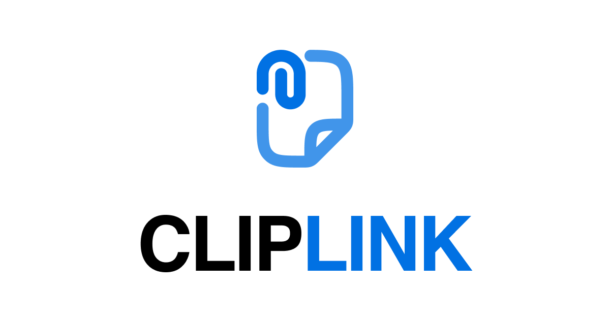

<div align="center">

# CLIPLINK

**Copy here. Paste anywhere.** Fast cross-device clipboard sync — no account, no install.

<p>
  <a href="https://nextjs.org"></a>
  <a href="https://github.com/thebkht/cliplink/actions/workflows/ci.yml"></a>
  <a href="https://www.npmjs.com/package/@thebkht/cliplink"></a>
  <a href="https://www.npmjs.com/package/@thebkht/rtc-file-transfer"></a>
  <a href="LICENSE"></a>
</p>

[**Live demo → cliplink.thebkht.com**](https://cliplink.thebkht.com)



</div>

---

## Why

Moving a URL, a snippet, or a file from your laptop to your phone is still solved badly. AirDrop is Apple-only. Nearby Share is Android-only. Everything genuinely cross-platform means emailing yourself, DMing yourself on Slack, or uploading to someone else's cloud.

CLIPLINK is the browser-native answer. Open a page, get a 6-character room code, share it with your other device — anything you send appears there instantly and is copied to the clipboard automatically.

Nothing persists. Rooms expire on a timer, history is session-local, and files never touch a server at all.

## Features

- **Zero auth, zero install** — create or join a room in one click, in any modern browser
- **Join three ways** — 6-character code, shared URL (`/room/X7KP2M#k=…`), or in-room QR code, encoded locally so the key never leaves the device
- **Encrypted both ways** — private rooms generate an AES-GCM-256 key in the browser that never reaches the server, carried in the URL fragment or pasted in; open rooms derive their key from the code, so the code alone opens them. Private rooms joined without a key open locked and unlock in place
- **Realtime text sync** — WebSocket transport, with HTTP polling as an automatic fallback
- **Auto-copy on receive** — incoming clips land on your clipboard, with a toast and a subtle flash
- **Session history** — last 20 clips with direction, timestamp, one-click copy, expand-in-place, and an Open action on link clips
- **Keyboard-first** — every room action has a binding; `?` shows the cheat sheet and `⌘K`/`Ctrl+K` opens the command palette
- **Know the state** — device count, a live expiry countdown, and a badge that says when you have dropped to the polling fallback
- **Peer-to-peer file transfer** — up to 500 MB per file over WebRTC data channels, via attach, drag-and-drop, or paste. Drop or attach a whole folder (up to 50 files) and it arrives as one group, with Download all saving it into a folder of your choice where the browser allows it, or as a single zip (up to 1 GB, held in memory until it's saved). Bytes flow browser-to-browser; the server only relays signaling. Every block is SHA-256 verified and the whole file is checked against a digest that travelled over signaling rather than the data channel. A download can be paused and picked back up, survives a dropped connection, and now survives a reload as well — a refreshed tab resumes from what is already on disk. Large files (64 MB+) stream straight to disk in every current browser, and progress shows speed and time left. The transfer engine is published on its own as [`@thebkht/rtc-file-transfer`](https://www.npmjs.com/package/@thebkht/rtc-file-transfer)
- **Share sheet target** — install CLIPLINK as an app and it appears in the OS share sheet. Shared text lands in the editor of a room open in another tab, or in one you create or join; shared files are offered to the room. The service worker keeps them on the device, so they never reach the server. Works on Android Chrome and installed desktop Chromium; iOS has no share targets for web apps
- **A CLI** — `git log -1 | cliplink send` creates a room, sends it, and prints a QR code for the phone. `cliplink recv --one | pbcopy` waits for the next clip and copies it. Same rooms, same encryption; `npm i -g @thebkht/cliplink`, documented in [CLI.md](packages/cliplink/CLI.md)
- **Ephemeral by design** — per-room TTL configurable from 1h to 24h (6h default), max 50 clips retained per room
- **Rate limited** — token buckets shared across instances through Redis: a burst of 60 clips refilling at 1/second, and 10 room creations refilling at 1 per 10 seconds

Exact limits live in [`lib/cliplink/constants.ts`](lib/cliplink/constants.ts).

### Keyboard shortcuts

`⌘` is `Ctrl` on Windows and Linux.

| Keys | Action |
| --- | --- |
| `Enter` | Send the clip |
| `⇧Enter` / `⌘Enter` | New line instead of sending |
| `⌘K` | Command palette |
| `⌘⇧C` | Copy the latest received clip |
| `⌘⇧V` | Paste from device into the editor |
| `⌘⇧⌫` | Clear the editor (undoable) |
| `?` | This list |

These work anywhere. The rest need focus to be outside the compose box:

| Keys | Action |
| --- | --- |
| `E` or `/` | Focus the editor |
| `L` | Copy the room link |
| `Q` | Show the QR code |
| `A` | Attach files |
| `F` | Attach a folder |
| `T` | Toggle the theme |
| `X` | Leave the room |
| `1`–`9` | Copy that history row |
| `Esc` | Close a sheet, cancel a pending Leave, or leave the editor |

Typing any other character with nothing focused starts a clip.

## Architecture

| Layer | Implementation |
| --- | --- |
| Framework | Next.js 16 App Router, React 19, TypeScript |
| Styling | Tailwind CSS v4 |
| Storage | Upstash Redis (hash + sorted set per room), in-memory fallback |
| Realtime | WebSocket primary, HTTP polling fallback |
| Fan-out | Redis pub/sub via `ioredis`, process-local `EventEmitter` fallback |
| Files | WebRTC data channels, peer-to-peer |
| Hosting | Vercel — stock Next.js build, no custom adapter |

Two things here are worth reading even if you never run CLIPLINK:

**The transport abstraction.** Both realtime transports implement one `TransportClient` interface ([`packages/cliplink/src/types.ts`](packages/cliplink/src/types.ts)), so the room UI's retry/backoff/fallback state machine is written once. WebSockets ([`ws.ts`](packages/cliplink/src/ws.ts)) replaced an earlier SSE implementation without the UI changing at all; polling ([`http.ts`](packages/cliplink/src/http.ts)) remains the fallback. The same interface is what let a CLI reuse the whole stack: it supplies `ws` in place of the browser's global and gets the same encryption, the same backoff and the same fallback. Running WebSockets on Vercel Functions is documented thinly elsewhere — this is a complete working example.

**One implementation of the encryption.** The crypto, wire types and transports live in [`@thebkht/cliplink`](packages/cliplink), consumed by the app through thin re-exports in `lib/cliplink/`. A second implementation is the expensive part of every non-browser surface and the one most likely to drift, so there is exactly one — and its tests pin ciphertexts from earlier builds, since tabs opened before a deploy keep talking to ones opened after it.

**Server-free file transfer.** [`@thebkht/rtc-file-transfer`](packages/rtc-file-transfer) implements offer/accept, chunking with backpressure in both directions, stall detection, block-level integrity checks and a whole-file digest, pause, resume — across a dropped connection or a reload — streaming to disk, and withdrawal over raw WebRTC data channels, with no TURN-dependent SaaS in the middle. It is 1.0.0: the API follows semver and wire protocol v1 is permanent, so any two versions interoperate. It lives in this repo as a workspace package, is [published to npm](https://www.npmjs.com/package/@thebkht/rtc-file-transfer) with provenance, and works with any signaling channel — with adapters ready for WebSocket, `BroadcastChannel`, Supabase Realtime, Trystero, PeerJS and simple-peer:

```bash
npm install @thebkht/rtc-file-transfer
```

The API surface is four routes: `POST /rooms` (create), `GET /rooms/:code` (fetch), `POST|GET /rooms/:code/clips` (send / poll after id), and `GET /rooms/:code/socket` (WebSocket upgrade for clips and signaling).

## Getting started

**No Redis and no Vercel account are required.** Without credentials the app falls back to an in-memory store and a process-local event bus, which is enough to develop against and to sync between two tabs on one machine.

```bash
git clone https://github.com/thebkht/cliplink.git
cd cliplink
pnpm install
pnpm dev
```

Open <http://localhost:3000>.

Requires Node.js >= 20.9 and [pnpm](https://pnpm.io). The fallback is single-process only — state is lost on restart and is not shared across instances, so for the full experience (cross-instance fan-out, atomic rate limiting) provision Redis as below.

## Environment variables

Every variable is optional. Copy [`.env.example`](.env.example) to `.env.local` and fill in what you need.

| Variable | Purpose | If unset |
| --- | --- | --- |
| `UPSTASH_REDIS_REST_URL` | Room + clip storage, rate limiting | In-memory store |
| `UPSTASH_REDIS_REST_TOKEN` | Same | In-memory store |
| `UPSTASH_REDIS_URL` | `rediss://` connection for pub/sub fan-out | Fan-out is process-local |
| `NEXT_PUBLIC_ICE_SERVERS` | JSON array of `RTCIceServer`; add a TURN relay for restrictive NATs | Public STUN servers |

Aliases are also accepted, so the Vercel Upstash integration works with no renaming: `KV_REST_API_URL` / `KV_REST_API_TOKEN` for the REST pair, and `REDIS_URL` / `KV_URL` for the pub/sub connection.

## Self-hosting

Provision an Upstash Redis database (the [Vercel Marketplace](https://vercel.com/marketplace) integration wires the variables up automatically), then:

```bash
vercel deploy
vercel domains add <your-domain>   # optional
```

It is a stock Next.js App Router build, so anywhere that runs Next.js 16 with WebSocket support will work.

## Packages

| Package | Version | Description |
| --- | --- | --- |
| [`@thebkht/rtc-file-transfer`](packages/rtc-file-transfer) | [](https://www.npmjs.com/package/@thebkht/rtc-file-transfer) | Peer-to-peer file transfer over WebRTC data channels, with backpressure, integrity checks, pause and resume (including across a reload), streaming to disk, and offer/revoke. Zero dependencies. Bring your own signaling. |
| [`@thebkht/cliplink`](packages/cliplink) | — | The room protocol — end-to-end encryption, the wire types, and the HTTP and WebSocket transports — plus the [`cliplink` CLI](packages/cliplink/CLI.md) built on it. |

Packages release independently. To publish one, bump its version and changelog, merge to `main`, then push a tag like `rtc-file-transfer@v1.0.0`. The [release workflow](.github/workflows/release-rtc-file-transfer.yml) tests and builds the package, publishes it to npm with provenance through trusted publishing (so no npm token is stored in the repo), and creates the GitHub release from the changelog.

## Roadmap

- **Test coverage** — the file-transfer package is tested; the app, starting with the transport state machine, is not yet
- **WebRTC reliability** across restrictive NATs

Have an idea? [Open an issue](https://github.com/thebkht/cliplink/issues/new/choose).

## Contributing

Contributions are welcome — see [CONTRIBUTING.md](CONTRIBUTING.md). Please read the [Code of Conduct](CODE_OF_CONDUCT.md).

For security issues, do **not** open a public issue. See [SECURITY.md](SECURITY.md).

## License

[MIT](LICENSE) © Bakhtiyor Ganijon
